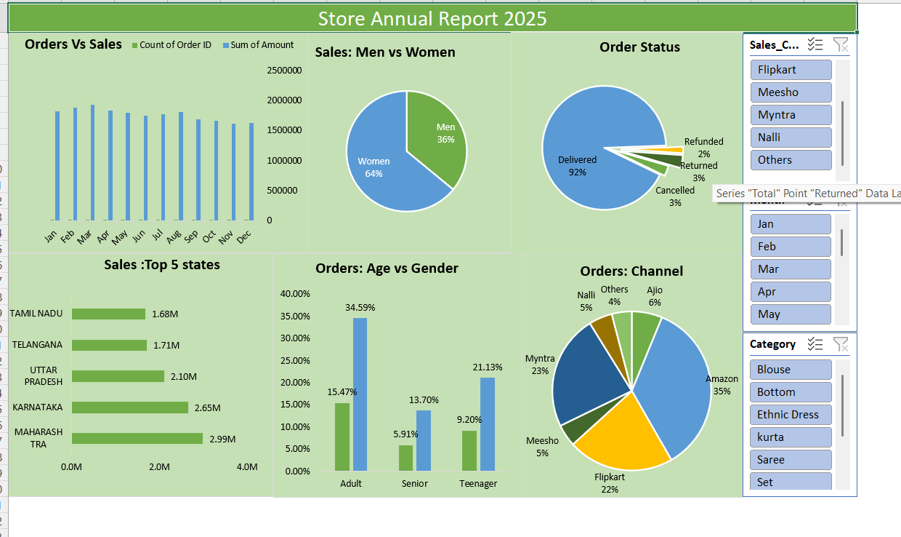

# 🛍 Retail Sales Analysis & Store Annual Dashboard (2025)

## 📌 Project Objective
The objective of this project is to analyze retail sales data to understand **customer purchasing behavior, sales performance, and order fulfillment efficiency** over the year 2025.  
This project demonstrates an **end-to-end data analytics workflow** using **SQL for data analysis** and **Excel for interactive dashboard visualization**, enabling data-driven business decision-making.

---

## ❓ Business Questions Addressed
This project answers key business and recruiter-focused questions:

1. How do **monthly order volume and sales revenue** trend across the year?
2. Which month shows the **strongest overall sales performance**?
3. What is the **sales contribution split between men and women**?
4. How efficient is the **order fulfillment process**?
5. Which **states contribute the highest sales**?
6. How do **age groups and gender** influence customer ordering behavior?
7. Which **sales channels perform best** in terms of orders and revenue?

---

## 🗂 Dataset Overview
- Total Records: ~3,900 retail orders  
- Dataset Type: Transactional sales data  

### Key Attributes
- Order ID, Order Date, Order Status  
- Customer Age Group, Gender  
- Product Category, Quantity  
- Sales Channel (Amazon, Flipkart, Myntra, etc.)  
- Shipping State & City  
- Order Amount  

---

## 🛠 Tools & Technologies Used
- **Excel** – Data cleaning, pivot tables, and interactive dashboard  
- **SQL (PostgreSQL / MySQL)** – Data aggregation and business analysis  
- **PowerPoint** – Business insights presentation  
- **GitHub** – Project documentation and version control  

---

## 📊 Key Analysis & Insights

### 🔹 Orders vs Sales Trend
- Monthly order volume and sales revenue show a **strong positive correlation**
- Indicates stable customer demand throughout the year

### 🔹 Best Performing Month
- Mid-year months recorded the **highest sales and order volume**
- Useful for sales planning and promotional strategy

### 🔹 Gender-wise Sales Contribution
- **Women contribute ~64%** of total sales  
- Men contribute ~36%  
- Highlights higher engagement among female customers

### 🔹 Order Fulfillment Efficiency
- **92% of orders were successfully delivered**
- Low cancellation and return rate (~6%)
- Reflects efficient logistics and operations

### 🔹 Top Performing States
- Maharashtra, Karnataka, and Uttar Pradesh lead in total sales
- Sales are concentrated in high-demand regions

### 🔹 Age Group vs Gender Analysis
- Adult customers generate the highest number of orders
- Teenagers show strong participation, especially among female customers
- Seniors contribute a smaller but consistent share

### 🔹 Sales Channel Performance
- Amazon and Flipkart dominate overall sales
- Myntra performs strongly in fashion-related categories
- Other platforms contribute niche sales

---

## 📊 Excel Dashboard Preview

---

## 🧮 SQL Analysis Summary
SQL queries were used to:
- Analyze monthly sales and order trends  
- Calculate gender-wise revenue contribution  
- Evaluate order status distribution  
- Identify top-performing states  
- Compare channel-wise sales performance  

📄 SQL File:  
➡️ [Retail_Sales_Analysis.sql](Retail_Sales_Analysis.sql)

---

## 📂 Project Files (Clickable)
- 📊 [Excel Dashboard Image](Dashboard.png)
- 📑 [Project Presentation (PPT)](Retail%20Sales%20PPT.pdf)
- 🧮 [SQL Analysis File](Retail_Sales_Analysis.sql)
- 🧹 [Cleaned Dataset (CSV)](cleaned_data.csv)
- 📈 [Raw Excel Data](retail_sales_data.xlsx)
- 📄 [README](README.md)

---

## 🎯 Key Learnings
- End-to-end retail data analysis workflow
- Writing optimized SQL queries for business insights
- Designing clean and insightful Excel dashboards
- Presenting analytical findings in a business-friendly manner

---

## 🚀 Future Enhancements
- Power BI interactive dashboard
- Python-based exploratory data analysis (EDA)
- Sales forecasting and predictive modeling

---

## 👩‍💻 Author
**Seema Kumari**  
Aspiring Data Analyst  

**Skills:** Excel | SQL | Power BI | Python | Statistics  

⭐ Open to internship and entry-level opportunities in Data & Analytics.

